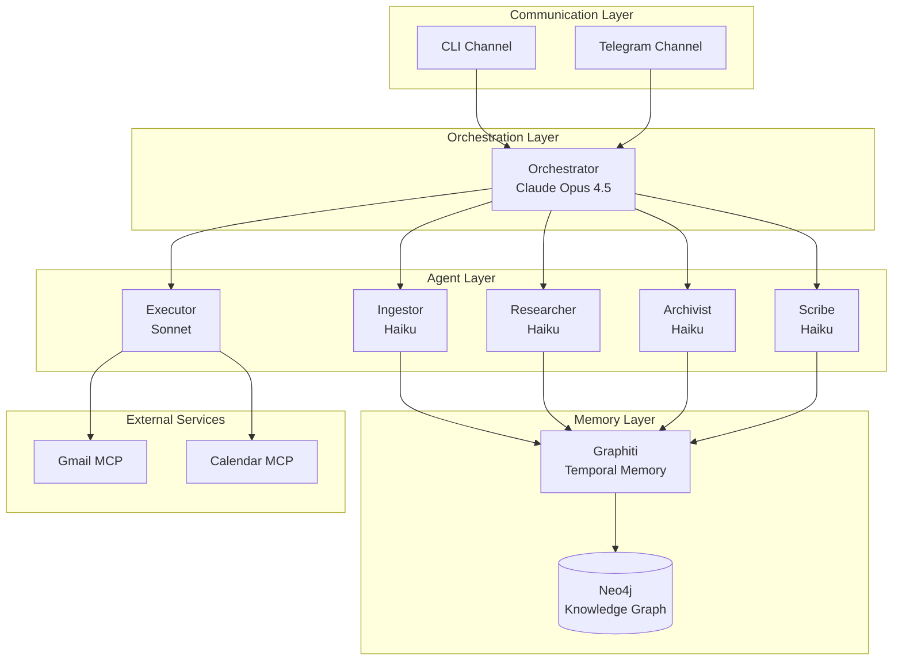
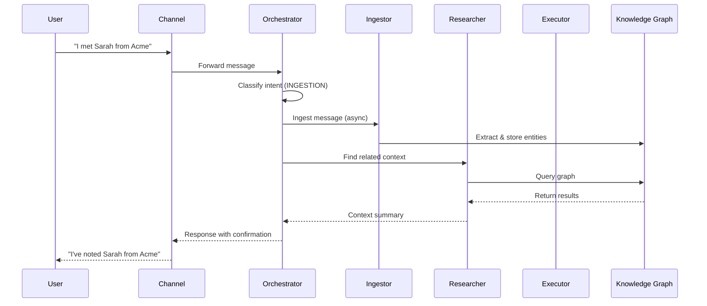
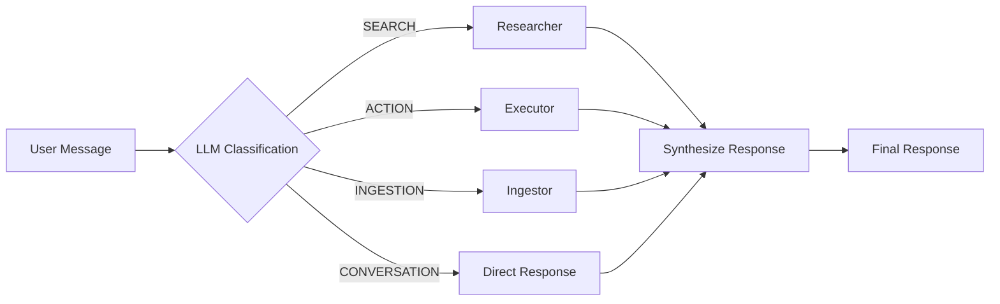
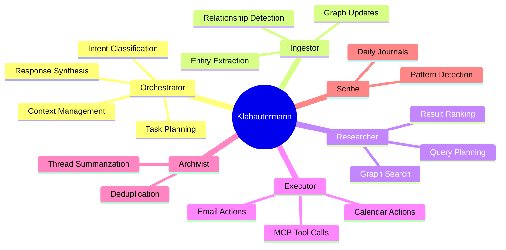
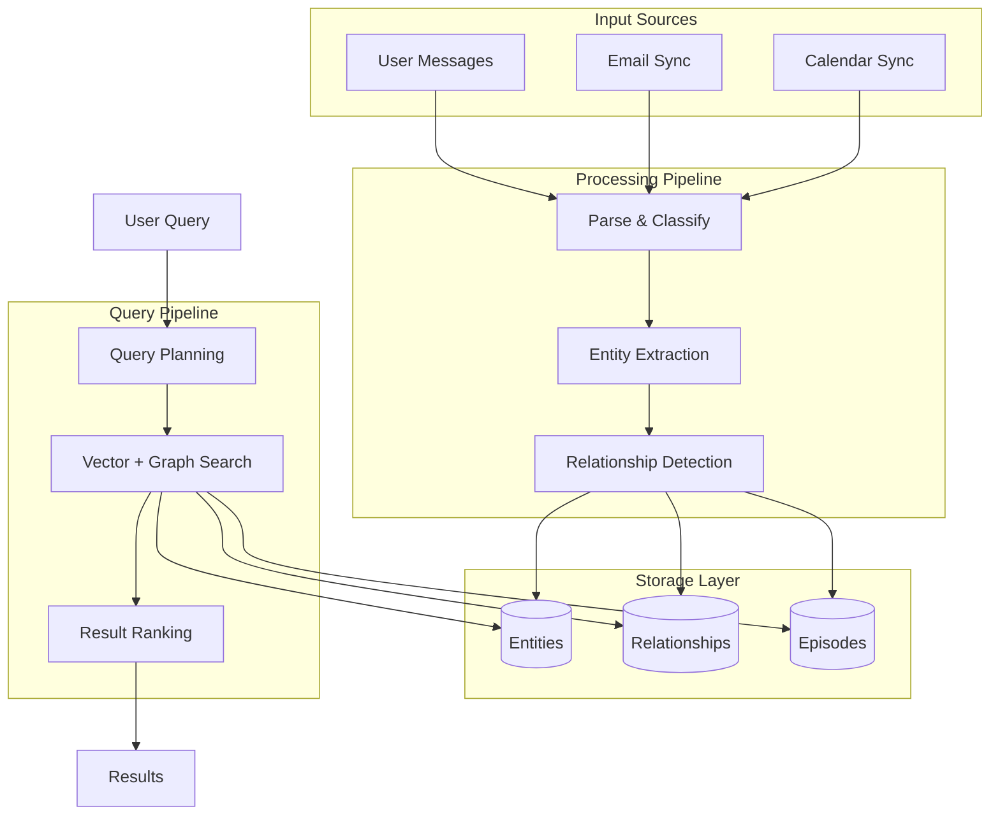
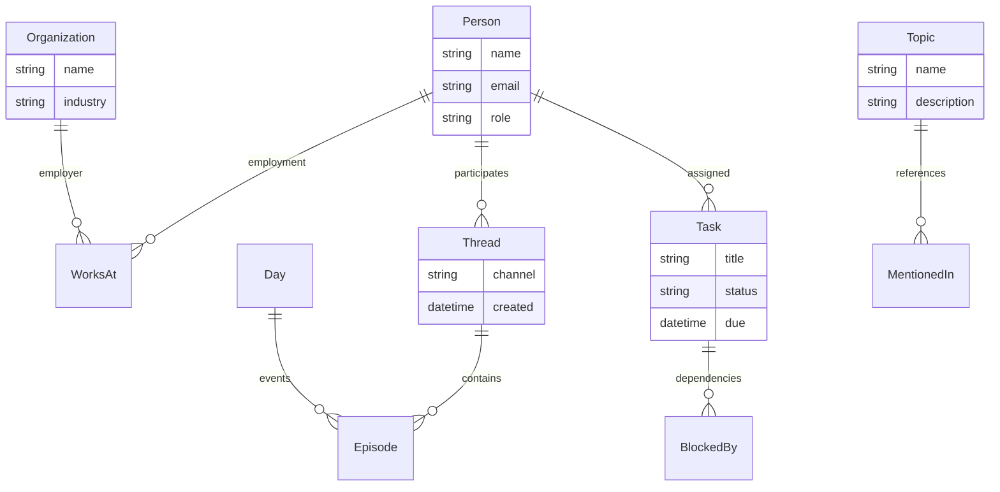
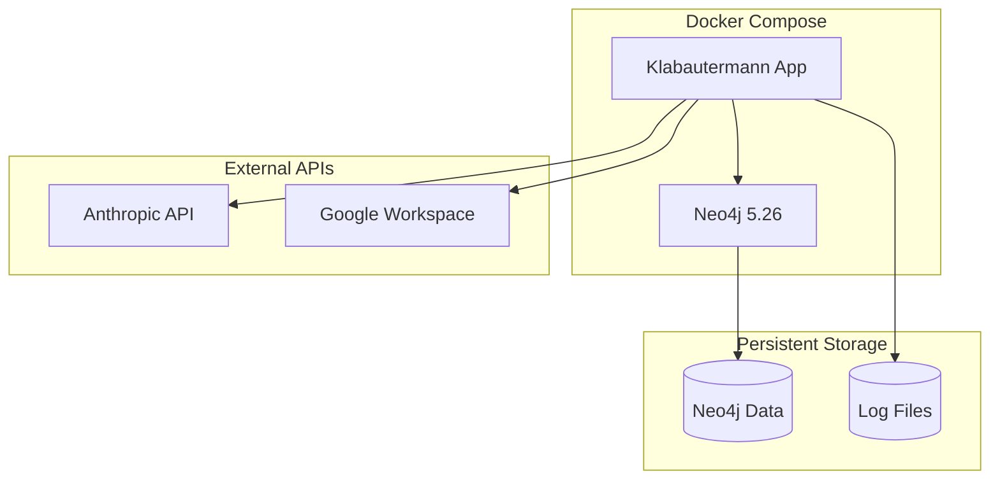

# Architecture Diagrams

Visual diagrams of Klabautermann's architecture using Mermaid for GitHub rendering.

## System Overview

## Message Flow

## Intent Classification Flow

## Agent Responsibilities

## Data Flow

## Entity Types (Ontology)

## Deployment Architecture

## See Also

- [Full Agent Specification](../specs/architecture/AGENTS.md)
- [Memory Architecture](../specs/architecture/MEMORY.md)
- [Ontology Definition](../specs/architecture/ONTOLOGY.md)
- [MCP Integration](../specs/architecture/MCP.md)
